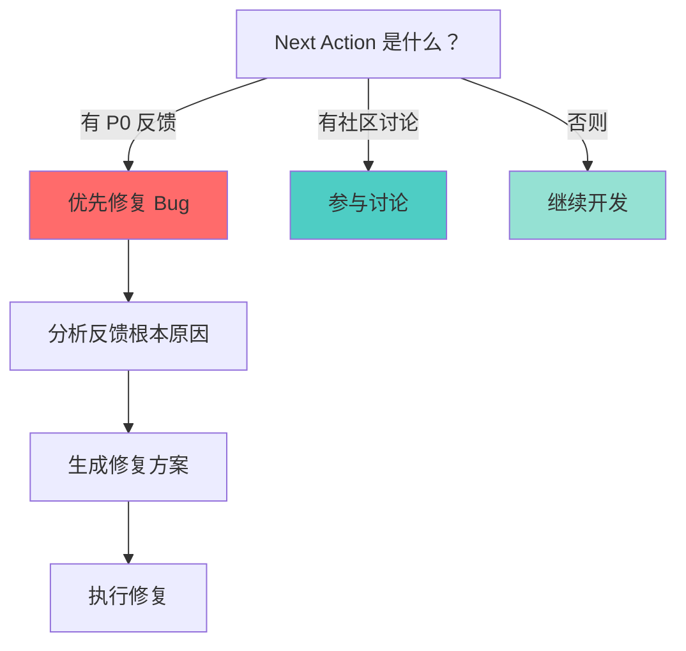

# Agent Loop

**一个可观测的自主 Agent 运行时内核**

```
┌─────────────────────────────────────────────────────────────────────────┐
│                         Agent Loop 架构                                  │
│                                                                         │
│   你的 Agent 项目                                                        │
│         ↓                                                               │
│   ┌─────────────────────────────────────────────────────────────────┐   │
│   │                    Agent Loop Core                               │   │
│   │  ┌────────────────────────────────────────────────────────────┐ │   │
│   │  │  Perception Layer (感知层)                                  │ │   │
│   │  │  - 读取共识/状态文件                                        │ │   │
│   │  │  - 读取互联网信号（RSS/社媒）                               │ │   │
│   │  │  - 读取用户反馈                                             │ │   │
│   │  └────────────────────────────────────────────────────────────┘ │   │
│   │  ┌────────────────────────────────────────────────────────────┐ │   │
│   │  │  Cognition Layer (认知层) ← 可观测！                        │ │   │
│   │  │  - 思考过程 (流式输出到日志)                                │ │   │
│   │  │  - 决策链 (结构化事件)                                      │ │   │
│   │  │  - 优先级排序 (带权重的决策矩阵)                            │ │   │
│   │  └────────────────────────────────────────────────────────────┘ │   │
│   │  ┌────────────────────────────────────────────────────────────┐ │   │
│   │  │  Action Layer (行动层) ← 可观测！                           │ │   │
│   │  │  - 工具调用 (记录调用参数/返回/耗时)                        │ │   │
│   │  │  - 文件操作 (diff 实时输出)                                  │ │   │
│   │  │  - Shell 执行 (stdout/stderr 实时捕获)                       │ │   │
│   │  └────────────────────────────────────────────────────────────┘ │   │
│   │  ┌────────────────────────────────────────────────────────────┐ │   │
│   │  │  Memory Layer (记忆层)                                      │ │   │
│   │  │  - 共识更新 (带版本控制)                                    │ │   │
│   │  │  - 事件日志 (结构化 JSONL)                                  │ │   │
│   │  │  - 工具缓存 (避免重复调用)                                  │ │   │
│   │  └────────────────────────────────────────────────────────────┘ │   │
│   └─────────────────────────────────────────────────────────────────┘   │
│         ↓                                                               │
│   输出：                                                                  │
│   - 实时日志流 (stdout/websocket)                                       │
│   - 结构化事件 (JSONL 文件)                                              │
│   - 调用链追踪 (trace.json)                                             │
│   - 决策树可视化 (decision-tree.svg)                                    │
└─────────────────────────────────────────────────────────────────────────┘
```

---

## 核心特性

### 1. 自主循环运行

```python
from agent_loop import AgentLoop

loop = AgentLoop(
    prompt_file="./PROMPT.md",
    consensus_file="./memories/consensus.md",
    interval_seconds=30,  # 周期间隔
    timeout_seconds=1800, # 单周期超时
)

# 运行
loop.run()  # 单周期
loop.start_daemon()  # 守护进程
```

### 2. LLM 调用（带完整过程输出）

```python
# 输入
from agent_loop.llm import call_llm

response = call_llm(
    model="claude-sonnet-4-6",
    prompt="分析当前共识，决定下一步行动",
    # 关键：流式输出思考过程
    on_think_chunk=lambda chunk: print(f"🤔 思考：{chunk}", flush=True),
    # 工具调用回调
    on_tool_call=lambda tool, args: print(f"🔧 调用工具：{tool}({args})"),
)

# 输出包含完整上下文
print(response.thought_process)  # 完整思考链
print(response.tool_calls)       # 工具调用列表
print(response.decision_tree)    # 决策树
```

### 3. 工具调用（全链路追踪）

```python
from agent_loop.tools import ToolRegistry

# 注册工具
@ToolRegistry.register(
    name="write_file",
    description="写入文件内容",
    observable=True,  # 启用观测
)
def write_file(path: str, content: str) -> dict:
    return {"ok": True, "path": path, "bytes": len(content)}

# 调用时自动记录
result = ToolRegistry.call(
    "write_file",
    path="./test.txt",
    content="hello",
    # 自动记录到 trace.json
)
```

### 4. 思考过程（实时流式输出）

```
┌─────────────────────────────────────────────────────────────────────────┐
│  周期 #42 思考过程 (实时输出)                                           │
├─────────────────────────────────────────────────────────────────────────┤
│  [10:00:00] 🧠 开始分析共识...                                          │
│  [10:00:01] 📖 读取 consensus.md (版本 v15)                             │
│  [10:00:02] 🤔 检测到 Next Action: "修复登录流程"                       │
│  [10:00:03] 🔍 检查反馈文件 docs/feedback/...                           │
│  [10:00:04] ⚠️  发现 3 个 P0 级别的负面反馈                              │
│  [10:00:05] 💡 决策：优先修复登录表单                                    │
│  [10:00:06] 🔧 准备调用工具：edit_file                                  │
│  [10:00:07] ✏️  正在修改 src/pages/login.tsx...                         │
│  [10:00:15] ✅ 文件修改完成 (+45 -12)                                   │
│  [10:00:16] 📝 更新 consensus.md...                                     │
│  [10:00:17] ✅ 周期完成                                                 │
└─────────────────────────────────────────────────────────────────────────┘
```

### 5. 调用链追踪

每个周期生成 `trace.json`：

```json
{
  "cycle_id": 42,
  "start_time": "2026-03-06T10:00:00Z",
  "end_time": "2026-03-06T10:00:17Z",
  "duration_ms": 17000,
  "spans": [
    {
      "span_id": "span_001",
      "name": "analyze_consensus",
      "start": "10:00:00",
      "end": "10:00:02",
      "input": {"consensus_version": "v15"},
      "output": {"next_action": "修复登录流程"}
    },
    {
      "span_id": "span_002",
      "name": "call_llm",
      "parent_span_id": "span_001",
      "start": "10:00:02",
      "end": "10:00:05",
      "input": {"prompt": "...", "model": "claude-sonnet-4-6"},
      "output": {
        "thought_tokens": 1250,
        "decision": "优先修复登录表单"
      }
    },
    {
      "span_id": "span_003",
      "name": "tool_call:edit_file",
      "parent_span_id": "span_001",
      "start": "10:00:06",
      "end": "10:00:15",
      "input": {"path": "src/pages/login.tsx", "changes": "..."},
      "output": {"added": 45, "removed": 12}
    }
  ],
  "decision_tree": {
    "root": "Next Action 是什么？",
    "branches": [
      {"condition": "有 P0 反馈", "decision": "优先修复"},
      {"condition": "有社区讨论", "decision": "参与讨论"},
      {"condition": "否则", "decision": "继续开发"}
    ]
  }
}
```

---

## 可观测性输出

### 1. 实时日志流

```bash
# 运行周期
agent-loop run --verbose

# 输出
[10:00:00] Cycle #42 started
[10:00:01]   📖 Reading consensus.md (v15)
[10:00:02]   🤔 Analyzing next action...
[10:00:03]   💡 Decision: Fix login flow (priority: P0)
[10:00:04]   🔧 Calling tool: edit_file(src/pages/login.tsx)
[10:00:15]   ✅ File updated (+45 -12)
[10:00:16]   📝 Updating consensus...
[10:00:17] Cycle #42 completed (17s)
```

### 2. 结构化事件日志 (JSONL)

```jsonl
{"timestamp":"2026-03-06T10:00:00Z","event":"cycle_start","cycle_id":42}
{"timestamp":"2026-03-06T10:00:01Z","event":"consensus_read","version":"v15"}
{"timestamp":"2026-03-06T10:00:02Z","event":"llm_call_start","model":"claude-sonnet-4-6"}
{"timestamp":"2026-03-06T10:00:03Z","event":"thought","chunk":"检测到 P0 反馈..."}
{"timestamp":"2026-03-06T10:00:04Z","event":"tool_call","name":"edit_file","args":{"path":"..."}}
{"timestamp":"2026-03-06T10:00:15Z","event":"tool_result","name":"edit_file","result":{"added":45}}
{"timestamp":"2026-03-06T10:00:17Z","event":"cycle_complete","duration_ms":17000}
```

### 3. 决策树可视化



### 4. WebSocket 实时推送

```python
# 前端连接
import websocket

ws = websocket.connect("ws://localhost:8787/logs")

for message in ws:
    event = json.loads(message)
    print(f"[{event['timestamp']}] {event['event']}: {event.get('data')}")

# 输出
# [10:00:00] cycle_start: {"cycle_id": 42}
# [10:00:02] thought: {"chunk": "检测到 P0 反馈..."}
# [10:00:04] tool_call: {"name": "edit_file", "args": {...}}
```

---

## 项目结构

```
agent-loop/
├── agent_loop/
│   ├── __init__.py
│   ├── core.py              # 核心循环逻辑
│   ├── llm/
│   │   ├── __init__.py
│   │   ├── client.py        # LLM 调用（流式输出）
│   │   └── types.py         # 响应类型定义
│   ├── tools/
│   │   ├── __init__.py
│   │   ├── registry.py      # 工具注册表
│   │   ├── file_ops.py      # 文件操作工具
│   │   └── shell.py         # Shell 执行工具
│   ├── observability/
│   │   ├── __init__.py
│   │   ├── logger.py        # 结构化日志
│   │   ├── tracer.py        # 调用链追踪
│   │   └── websocket.py     # 实时推送
│   ├── memory/
│   │   ├── __init__.py
│   │   ├── consensus.py     # 共识管理
│   │   └── event_store.py   # 事件存储
│   └── cli.py               # 命令行入口
├── examples/
│   ├── auto-company-integration/
│   └── custom-agent/
├── tests/
├── pyproject.toml
└── README.md
```

---

## 快速开始

### 安装

```bash
pip install agent-loop
```

### 基础用法

```python
from agent_loop import AgentLoop

# 创建 Agent
loop = AgentLoop(
    prompt_file="./PROMPT.md",
    consensus_file="./consensus.md",
    # 可观测性配置
    log_file="./logs/events.jsonl",
    trace_file="./logs/trace.json",
    websocket_port=8787,  # 启用实时推送
)

# 运行单周期
result = loop.run()

# 输出完整报告
print(result.report())
print(result.thought_chain)
print(result.tool_calls)
```

### 作为库使用

```python
from agent_loop.core import run_cycle
from agent_loop.observability import ObservabilityConfig

# 运行单周期（带观测）
result = run_cycle(
    prompt="分析当前状态，决定下一步行动",
    consensus_path="./consensus.md",
    config=ObservabilityConfig(
        verbose=True,           # 详细输出
        log_thoughts=True,      # 记录思考过程
        trace_tools=True,       # 追踪工具调用
    ),
)
```

---

## 与 Auto-Company 的关系

| 层次 | Auto-Company | Agent Loop |
|------|--------------|------------|
| **定位** | 完整 AI 公司应用 | Agent 运行时内核 |
| **LLM** | Claude/Codex CLI | 任意 LLM（通过标准接口） |
| **工具** | 30+ Skills | 基础工具集（文件/Shell） |
| **观测** | 黑盒（只看结果） | 白盒（思考/调用/决策全可见） |
| **复用** | 困难 | 容易（pip install） |

**迁移路径**：

```bash
# Auto-Company v3 使用 Agent Loop
pip install agent-loop

# 修改 auto-loop.sh
agent-loop run \
  --prompt-file PROMPT.md \
  --consensus-file memories/consensus.md \
  --verbose  # 完整过程输出
```

---

## 设计原则

1. **可观测性优先** — 所有过程必须可见、可记录、可追溯
2. **极简核心** — 只包含 Agent 运行最基础的逻辑
3. **工具中立** — 不绑定任何外部工具/Skills
4. **嵌入式设计** — 作为库被其他项目调用，不是独立应用

---

## License

MIT
